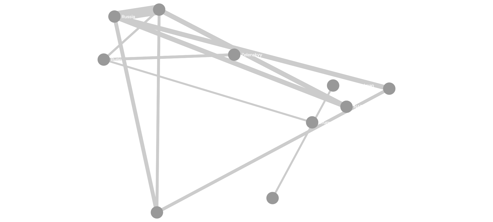

# Análise de Co-ocorrência com NER em Videocasts

## Desenvolvido por:
Otavio Antonio da Silva Junior


## Introdução

Este projeto aplica técnicas de Processamento de Linguagem Natural (NLP) para analisar transcrições de videocasts e identificar relações entre entidades nomeadas (pessoas, organizações e locais). O objetivo é construir grafos de co-ocorrência que permitam visualizar e interpretar conexões entre entidades ao longo do discurso.


## Descrição das Atividades Realizadas

O desenvolvimento do projeto foi dividido nas seguintes etapas:

1. **Coleta de Dados:**  
   As transcrições dos videocasts foram obtidas automaticamente por meio de um script em Python (`transcricoes.py`), responsável por extrair e estruturar os dados em arquivos no formato `.csv`.

2. **Extração de Entidades (NER):**  
   Foi utilizada a biblioteca `spaCy` para identificar entidades nomeadas, com foco nas categorias:
   - PERSON (pessoas)
   - ORG (organizações)
   - GPE (locais)

3. **Segmentação de Texto:**  
   Foram implementadas as abordagens:
   - Segmentação por sentenças  
   - ~~Segmentação por parágrafo~~
   - Segmentação por janelas de caracteres (k-caracteres)

4. **Cálculo de Co-ocorrência:**  
   Entidades próximas no texto foram consideradas relacionadas, gerando conexões entre elas.

5. **Construção do Grafo:**  
   Utilizou-se a biblioteca `NetworkX` para modelar a rede de relações.

6. **Exportação e Visualização:**  
   Os grafos foram exportados no formato `.gexf` e analisados na ferramenta Gephi.


## Principais Resultados

A execução do projeto resultou na geração de grafos de co-ocorrência que evidenciam:

- Relações frequentes entre entidades mencionadas  
- Entidades com maior centralidade nos discursos  
- Formação de agrupamentos temáticos (clusters)  


## Exemplo de Saída

Abaixo está um exemplo de grafo gerado a partir das análises:




## Análise e Discussão

A análise dos grafos permitiu observar que:

- Algumas entidades apresentam alta centralidade, indicando maior relevância dentro do discurso analisado
- Existem clusters que refletem grupos de entidades frequentemente mencionadas em conjunto
- A estrutura do grafo varia conforme o método de segmentação utilizado

## Comparação das Abordagens

Segmentação por sentenças:
- Produz relações mais precisas, porém mais restritas

Segmentação por k-caracteres:
- Captura relações mais amplas, aumentando a densidade do grafo, mas podendo introduzir mais ruído

Esses resultados demonstram que a escolha da estratégia de segmentação impacta diretamente na qualidade e interpretação das relações extraídas.


## Estrutura do Repositório
* `data/`: Contém as transcrições originais em formato `.csv`.
* `scripts/`: Notebook principal para execução no Google Colab.
* `assets/`: Arquivos de grafos gerados para análise.

## Tecnologias Utilizadas
* **Python 3.x**
* **Pandas:** Manipulação de dados.
* **spaCy:** Processamento de Linguagem Natural.
* **NetworkX:** Construção e manipulação de estruturas de grafos.
* **RegEx:** Segmentação de texto avançada.

## Como Executar

Caso deseje gerar novas transcrições, siga todas as etapas abaixo.  
Caso contrário, inicie diretamente pela etapa de análise.

### Coleta de dados Automatizada

### 1. Coleta de Dados

1. Acesse a pasta `scripts/`.
2. Instale a dependência necessária:

```bash
pip install youtube-transcript-api
```
3. Edite a lista de vídeos no script: ``video_ids = []``

4. Execute o script
```bash
python transcricoes.py
```

5. Mova os arquivos.`CSV` para a pasta data do seu repositorio.

### Análise NER

1. Configure as variáveis no notebook `analise_ner.ipynb`:
    - ``USUARIO_GIT``
    - ``REPOSITORIO``
    - ``BRANCH``
    - ``meus_arquivos`` (lista com os arquivos .csv)

2. Abra o notebook no Google Colab:
[](https://colab.research.google.com/github/OtavioAntonio/DCA3702_analise-ner-videocasts/blob/main/scripts/analise_ner.ipynb)

3. Certifique-se de configurar as variáveis no início do código:
    - `COLUNA_TEXTO`: Escolha o número da coluna que está o texto a ser analisado.
    - `MODO_SEGMENTACAO`: Escolha entre `sentenca`, ~~`paragrafo`~~ ou `k-caracteres`, para variar o modo de análise.
    - `CATEGORIAS_ALVO`: Escolha as relações que serão alvo da pesquisa `['PERSON', "ORG", "GPE"]`. Nesse caso será analisado a relação entre pessoas, organizações e países.
    - `MIN_PESO_GEPHI`: Escolha o valor mínimo de relações que devem aparecer nos textos para que o valor seja apresentado no resultado final (Grafo).
    - `K_VALOR`: Escolha o total de caracteres a serem analisados no modo `k-caracteres`.

4. Execute a célula para processar os arquivos da pasta `/data` e gerar o arquivo de grafo final.

## Visualização
Após a execução, o arquivo `grafo_segmentacao.gexf` será gerado. 

Para visualizar:
1. Baixe o arquivo gerado na pasta `Arquivos` do Google Colab.
2. Abra no [Gephi](https://gephi.org/).

## Licença
O projeto foi desenvolvido como parte da disciplina **DCA3702 - Algoritmos e Estrutura de Dados II**
